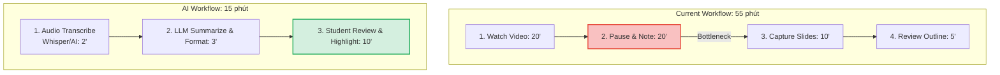

# 01 — Individual Problem Scan

> Điền theo Phase 1 + Phase 2 trong `01-worksheet.md`. Tự scan trước, dùng AI sau để phản biện. Không copy ví dụ Weekly Report.

## Thông tin cá nhân

- Họ và tên: Trần Chí Vĩ
- Mã học viên: 2A202602968
- Vai trò / bối cảnh: Sinh viên đại học / Nghiên cứu viên độc lập, đang phát triển dự án cá nhân **QuantAINexus** (Xây dựng AI Agent giao dịch dựa trên bài báo **FinWorld**), học tập cường độ cao tại chương trình **VIN AI thực chiến**, và tham gia báo cáo tại **Seminar chuyên ngành**.
- Công việc hằng tuần (phản ánh lịch trình đa nhiệm):
  - Tham gia học tập trên trường đại học và giải quyết các bài tập/đồ án môn học (Chiếm quỹ thời gian lớn).
  - Lên kế hoạch (Time-blocking) hàng tuần để cân bằng deadline giữa Trường đại học, VIN AI, Seminar và dự án cá nhân.
  - Đọc, tóm tắt paper học thuật (AI/Quant) và soạn slide thuyết trình cho buổi **Seminar chuyên ngành** (1-2 paper/tuần).
  - Nghiên cứu lý thuyết, hoàn thành bài Lab thực hành (code AI/xử lý dữ liệu) và nộp báo cáo định kỳ cho **VIN AI thực chiến**.
  - Code Python tái hiện các module của FinWorld, chạy backtest và phân tích log giao dịch cho dự án **QuantAINexus**.

---

## Phase 1 — Scan 5+ problems (tối thiểu 5, khuyến khích 8-10)

**Cách điền:** mỗi dòng = việc gì + ai chịu + đo bằng gì. Cột `Dấu hiệu thật` bắt buộc có số: mất bao lâu (bấm giờ mấy lần), mấy lần/tuần, bao nhiêu người gặp, log/ticket/quote nào.

| # | Lăng kính (Lặp lại / Tốn thời gian / AI có thể tốt hơn / Pain từ người khác) | Problem quan sát được | Ai chịu ảnh hưởng? | Dấu hiệu thật (số + bằng chứng) |
|---|---|---|---|---|
| 1 | Lặp lại | [Seminar] Đọc & tóm tắt paper toán/AI 10-15 trang để chuẩn bị slide báo cáo hàng tuần | Học viên seminar / Bản thân | 90-120 phút/paper, bấm giờ 3 bài gần nhất trung bình 105 phút/bài, lặp lại 2 lần/tuần |
| 2 | Tốn thời gian | [QuantAINexus] Tái hiện công thức toán/reward function từ paper FinWorld sang code Python (kẹt lỗi lệch chiều tensor) | Quant Developer / Bản thân | 60-90 phút/lần code, gặp 2-3 lần/tuần, commit log ghi 3 lần fix bug dimension |
| 3 | Tốn thời gian | [VIN AI] Xem lại video lecture và tổng hợp note lý thuyết siêu dài để chuẩn bị kiến thức trước khi làm Lab | Học viên VIN AI / Bản thân | 45-60 phút/video, học 2-3 video/tuần, thường xuyên phải tua lại để chép khái niệm |
| 4 | Lặp lại | [Quản lý lịch trình] Lên plan Time-blocking trên Notion để xếp lịch cho Trường, VIN AI, Seminar, và QuantAINexus | Sinh viên / Bản thân | 30-40 phút/cuối tuần, thường bị vỡ lịch giữa tuần do đánh giá sai thời gian task |
| 5 | AI có thể tốt hơn | [QuantAINexus] Đọc log backtest CSV để chẩn đoán nguyên nhân chiến lược bị sụt giảm (Drawdown) | Quant Dev / Bản thân | 45-60 phút/lần soi log, thực hiện 2-3 lần/tuần sau khi chạy backtest dài |
| 6 | Pain từ người khác | [VIN AI] Định dạng báo cáo Lab bằng Markdown (chèn code, ảnh, công thức) nộp cho mentor hay bị lỗi hiển thị | Học viên VIN AI / Mentor | Tốn 25 phút/lần fix định dạng trước khi nộp, bị mentor nhắc lỗi format 2 lần/tháng |
| 7 | Tốn thời gian | [Seminar] Soạn slide thuyết trình từ file note (copy/paste text, công thức LaTeX, vẽ lại sơ đồ) | Presenter / Bản thân | 60 phút/buổi slide, thực hiện 1 lần/tuần trước ngày báo cáo |
| 8 | AI có thể tốt hơn | [VIN AI -> Quant] Tích hợp mô hình (vd: RAG, Transformer) học từ Lab VIN AI vào codebase QuantAINexus (bị conflict môi trường) | Developer / Bản thân | Tốn 2-3 tiếng/lần tích hợp để giải quyết Dependency Hell, làm 1-2 lần/tháng |
| 9 | Lặp lại | [QuantAINexus] Tiền xử lý, lọc bỏ tag HTML và làm sạch dữ liệu tin tức tài chính để làm input cho Agent | Data Explorer / Bản thân | Mất 30 phút/ngày thao tác regex cơ bản trên Pandas |
| 10 | Lặp lại | [QuantAINexus] Viết Unit Test cơ bản kiểm tra logic các Tool Call của tác tử giao dịch | Developer / Bản thân | 30 phút/module, làm 3-4 lần/tuần |

**AI đã dùng ở Phase 1 (nếu có):**
- Prompt đã hỏi: "Gợi ý cách phân bổ thời gian cho người vừa học đại học, vừa học VIN AI, vừa làm dự án Quant."
- Ý dùng được: AI khuyên nên dùng Time-blocking theo Context (Ngày học thuật, Ngày thực hành Lab, Ngày Code dự án).

**Self-check Phase 1:**
- [x] Đủ 5+ dòng, mỗi dòng có actor + số đo cụ thể
- [x] Dùng ít nhất 3/4 lăng kính
- [x] Không có dòng chung chung kiểu "mất nhiều thời gian"

---

## Phase 2 — Top 3 Problem Cards

### 2.1. Chọn top 3

Giữ bài nào: actor cụ thể, workflow vẽ được 3-7 bước, bottleneck ở 1 bước, impact đo được. Loại bài quá rộng.

| Rank | Problem (copy từ bảng scan) | Vì sao chọn (2-3 ý) | Điều còn chưa chắc |
|---|---|---|---|
| 1 | [Seminar] Đọc & tóm tắt paper toán/AI 10-15 trang để chuẩn bị slide báo cáo hàng tuần | - Vấn đề lặp lại tốn nhiều thời gian nhất hàng tuần.<br>- Nút thắt rõ ở việc đọc công thức toán phức tạp. | Khả năng OCR trích xuất công thức toán của LLM. |
| 2 | [QuantAINexus] Tái hiện công thức toán/reward function từ paper FinWorld sang code Python | - Giúp tăng tốc hiện thực hóa dự án cá nhân cốt lõi.<br>- Bottleneck ở việc debug vector/ma trận. | AI sinh code numpy có khớp 100% với logic toán học không. |
| 3 | [VIN AI] Xem lại video lecture và tổng hợp note lý thuyết siêu dài để chuẩn bị kiến thức trước khi làm Lab | - Nỗi đau trực tiếp do lịch trình học tập quá dày đặc.<br>- Trích xuất kiến thức tự động sẽ tiết kiệm năng lượng rất nhiều. | Liệu AI workflow này có đủ để giúp tôi ổn định lịch trình học gắt gao của VIN AI mà không làm đình trệ dự án cá nhân (Quant)? |

### 2.2. Problem Cards chi tiết (lặp lại cho cả 3 cards)

---

#### Problem Card #1 — Tóm tắt & Trích xuất Thuật toán từ Paper chuyên ngành cho Seminar

```text
Problem 1 câu:
Người thuyết trình seminar mất 105 phút để đọc và trích xuất phương pháp luận từ bài báo khoa học, trong đó việc đọc hiểu công thức toán là điểm nghẽn tốn thời gian nhất.

Actor:
Học viên seminar / Nghiên cứu viên.

Thời điểm / bối cảnh:
Hàng tuần, khi phải chuẩn bị tài liệu báo cáo Seminar chuyên ngành.

Current workflow 3-7 bước:
1. Skim Overview: Đọc lướt Abstract và Conclusion (10').
2. Read Math & Method: Đọc chi tiết và giải mã công thức toán (45').
3. Analyze Results: Soi bảng số liệu thí nghiệm (20').
4. Synthesize Notes: Ghi chú lại vào Markdown (15').
5. Draft Slides: Soạn phác thảo slide (15').

Bottleneck:
Bước 2 — Read Math & Method: tốn 45 phút do công thức chuyên ngành rất khó bóc tách.

Impact:
105 phút/paper x 2 paper/tuần = 210 phút (~3.5 giờ)/tuần.

Success metric:
Giảm thời gian xử lý 1 paper xuống 30 phút, đảm bảo trích xuất chính xác 100% công thức cốt lõi (có đối chiếu).

Non-AI alternative:
Chỉ đọc Abstract và bỏ qua việc hiểu sâu toán. (Hạn chế: Sẽ bị bí khi nhóm seminar đặt câu hỏi).

AI hypothesis:
Dùng Parser chuyên dụng (Mathpix/MinerU) để bóc tách PDF -> LLM cấu trúc tóm tắt -> Người dùng kiểm chứng 1-1 các công thức.

Quick gut:
[ ] No AI / process fix
[ ] Rule
[X] Workflow
[ ] Agent
[ ] Chưa biết
```

**Draft workflow Card #1:**

```mermaid
graph TD
    subgraph Current State [Current Workflow: 105 phút]
        A1[1. Skim Overview: 10'] --> A2[2. Read Math & Method: 45']
        A2 -->|Bottleneck| A3[3. Analyze Results: 20']
        A3 --> A4[4. Synthesize Notes: 15']
        A4 --> A5[5. Draft Slides: 15']
        style A2 fill:#f9c1c1,stroke:#e74c3c,stroke-width:2px
    end
    
    subgraph Future State [AI Workflow: 30 phút]
        B1[1. PDF Math Parsing <br/> Mathpix/MinerU: 2'] --> B2[2. AI Structuring Note: 3']
        B2 --> B3[3. Human Math Review & Cross-check: 15']
        B3 -->|Human Boundary| B4[4. Human Finalize Slide Draft: 10']
        style B3 fill:#d4efdf,stroke:#27ae60,stroke-width:2px
    end
```



---

#### Problem Card #2 — Tái hiện công thức toán từ Paper FinWorld sang Code Python (QuantAINexus)

```text
Problem 1 câu:
Quant Developer mất 75 phút để code lại các hàm toán học từ paper sang Python, thường xuyên bị kẹt ở khâu debug lỗi Mismatch Shape của Tensor/Ma trận.

Actor:
Quant Developer (Làm dự án QuantAINexus).

Thời điểm / bối cảnh:
Khi cần bổ sung tính năng / reward function mới từ FinWorld vào hệ thống.

Current workflow 3-7 bước:
1. Read Pseudocode: Hiểu thuật toán trên giấy (10').
2. Write Functions: Code khung hàm Python (15').
3. Implement Math: Code các phép nhân ma trận NumPy (15').
4. Debug Shape & Index: Fix lỗi chiều dữ liệu (30').
5. Document: Viết comment code (5').

Bottleneck:
Bước 4 — Debug Shape & Index: Mất 30 phút chạy thử, in ra shape, và sửa lại code.

Impact:
75 phút/lần x 2 lần/tuần = 150 phút/tuần.

Success metric:
Giảm tổng thời gian code & debug xuống 20 phút/hàm, code vượt qua Unit Test ở lần chạy đầu tiên.

Non-AI alternative:
Tự viết các hàm Helper assert shape thủ công trước khi tính toán.

AI hypothesis:
Đưa công thức LaTeX cho AI Coder -> AI sinh code Python kèm theo các dòng Assertions kiểm tra kích thước ma trận -> Dev review logic.

Quick gut:
[X] Workflow
```

**Draft workflow Card #2:**

```mermaid
graph TD
    subgraph Current State [Current Workflow: 75 phút]
        C1[1. Read Pseudocode: 10'] --> C2[2. Write Functions: 15']
        C2 --> C3[3. Implement Math: 15']
        C3 --> C4[4. Debug Shape: 30']
        C4 -->|Bottleneck| C5[5. Document: 5']
        style C4 fill:#f9c1c1,stroke:#e74c3c,stroke-width:2px
    end
    
    subgraph Future State [AI Workflow: 20 phút]
        D1[1. AI Code Gen + Assertions: 2'] --> D2[2. Run Pytest: 3']
        D2 --> D3[3. Developer Review Logic: 10']
        D3 -->|Human Boundary| D4[4. Commit Code: 5']
        style D3 fill:#d4efdf,stroke:#27ae60,stroke-width:2px
    end
```



---

#### Problem Card #3 — Tổng hợp kiến thức từ Video Lecture dài (VIN AI thực chiến)

```text
Problem 1 câu:
Học viên VIN AI mất 55 phút để xem, dừng video liên tục và ghi chép lại các khái niệm lý thuyết cốt lõi trước khi có thể bắt tay vào làm bài Lab.

Actor:
Học viên chương trình VIN AI thực chiến.

Thời điểm / bối cảnh:
Hàng tuần, trước khi bắt tay vào giải quyết bài tập Lab thực hành trên hệ thống.

Current workflow 3-7 bước:
1. Watch Video: Xem video lecture (20').
2. Pause & Note: Dừng video để ghi chép khái niệm (20').
3. Capture Slides: Chụp lại sơ đồ kiến trúc (10').
4. Review Outline: Đọc lại toàn bộ note để hiểu bức tranh chung (5').

Bottleneck:
Bước 2 — Pause & Note: Mất 20 phút (thường gấp đôi thời lượng gốc của đoạn video) do phải gõ lại text thủ công.

Impact:
55 phút/lecture x 3 lecture/tuần = 165 phút/tuần. (Làm hao hụt năng lượng trước khi làm Lab).

Success metric:
Rút ngắn thời gian ôn tập lý thuyết xuống 15 phút, có sẵn bản note Markdown chuẩn chỉnh gồm Text và Bullet points cốt lõi.

Non-AI alternative:
Xin slide PDF từ giảng viên để đọc, bỏ qua video. (Hạn chế: Mất đi các lời giải thích bằng miệng giá trị của mentor).

AI hypothesis:
Sử dụng công cụ AI Transcribe (Whisper) để chuyển audio thành text -> Dùng LLM tóm tắt, trích xuất từ khóa chuyên ngành -> Học viên review lại note.

Quick gut:
[X] Workflow
```

**Draft workflow Card #3:**



---

### 2.3. Card muốn pitch nhất (chuẩn bị 2 phút)

**Card tôi muốn pitch nhất:**

```text
Problem Card #1: Tóm tắt & Trích xuất Thuật toán từ Paper chuyên ngành cho Seminar
```

**Vì sao (2-3 câu: workflow gì, số đo gì, impact gì):**

```text
Điểm đau đầu nhất về mặt con người là giới hạn thể lực và trí lực: tôi bắt buộc phải có AI workflow hỗ trợ vì bản thân không thể tự gồng gánh và đảm bảo được một lịch trình đa nhiệm cường độ cao (ĐH, QuantAINexus, VIN AI, Seminar) bằng sức người thủ công. Việc mất 105 phút/paper (trong đó 45 phút kẹt cứng ở giải mã toán học) để chuẩn bị báo cáo Seminar hàng tuần gây cạn kiệt năng lượng trầm trọng. AI ở đây không chỉ để rút ngắn thời gian xuống 30 phút, mà là "chốt chặn sinh tồn" giúp tôi bảo toàn sức lực cho những thứ cốt lõi nhất (Code & Thực hành dự án QuantAINexus).
```

**Câu hỏi tôi muốn nhóm challenge (1-2 câu hỏi đúng chỗ yếu):**

```text
1. Liệu AI có khả năng giải mã chính xác các công thức toán học và ký hiệu Hy Lạp phức tạp từ file PDF 2 cột, hay sẽ sinh ra ảo giác (hallucination) làm hỏng tính logic của bài báo?
2. Nếu rút ngắn quá trình "tự đọc và giải mã", liệu tôi có bị hổng kiến thức chuyên môn khi bị giáo sư/khán giả đặt câu hỏi phản biện sâu trong buổi seminar không?
```

**AI phản biện Card (nếu có):**
- Điểm yếu AI chỉ ra: Rủi ro lỗi định dạng PDF 2 cột và ảo giác toán học rất cao nếu để LLM tự do đọc ảnh.
- Tôi sửa gì: Thêm bước dùng công cụ Parser chuyên dụng (Mathpix) để trích xuất LaTeX trước, và quy định bắt buộc phải có bước Human Review (15-20 phút) đối chiếu 1-1 với PDF gốc.

### Self-check nộp phần 01
- [x] Có 5+ problems + top 3 Cards đủ field
- [x] Mỗi Card có workflow trước/sau + bottleneck + metric + fallback
- [x] Đã chọn 1 card pitch + câu hỏi challenge
